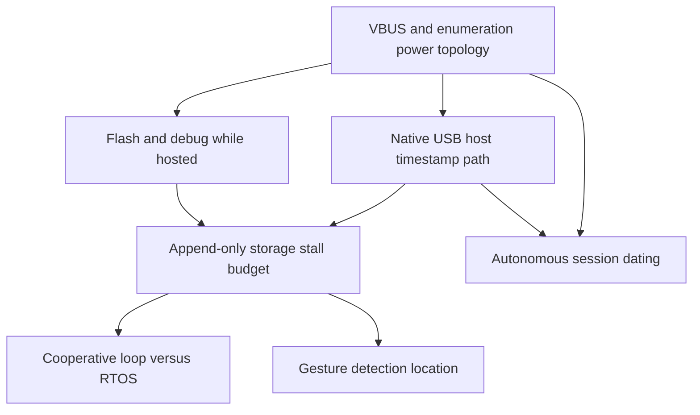

# Firmware Architecture Experiment Roadmap

This document turns the capture spec's open hardware assumptions into a sequence of experiments that maximize architectural confidence before implementation begins.

Scope: only load-bearing uncertainty on the firmware side. Exclude micro-optimizations, code style, and implementation detail that cannot change the architecture.

## 1. Ranked Unknowns

| Rank | Class | Unknown | Why it can change architecture | Spec anchor |
|---|---|---|---|---|
| 1 | Critical | Can the chosen ESP32-S3 host path enumerate the TD-02 and timestamp arrivals without extra host-side jitter? | If native host callbacks are not stable enough, the design may need MAX3421E, different board choice, or a different timestamp path. | Sections 3, 8.1, 8.2, 8.3 |
| 2 | Critical | Can the chosen power topology present reliable 5 V VBUS to the Roland in the real enclosure? | If not, the board choice, wiring, and even the host topology change. | Section 8.2 |
| 3 | Critical | Can the append-only storage path absorb worst-case write stalls with a finite RAM buffer? | If not, the storage medium, buffer depth, PSRAM use, or task split changes. | Sections 2, 6, 8.4 |
| 4 | Critical | Can the development loop flash and debug the board while the kit remains hosted? | If not, the board choice or transport strategy changes. | Sections 8.3, 8.5 |
| 5 | Critical | Can the firmware maintain usable session dating autonomously, or does it need host-provided time? | If not, the box needs RTC hardware or a permanent host dependency. | Sections 6, 8.5 |
| 6 | Critical | Can a single cooperative execution model meet capture, click, and storage deadlines, or is RTOS/task separation required? | If not, the internal concurrency architecture changes. | Sections 2, 3, 6, 8.3 |
| 7 | Important | Where does gesture detection live in the standalone box? | This changes scope and firmware complexity, but not the raw data contract. | Section 5, decision 9c |
| 8 | Important | Is the click output path actually practical through the intended DAC and MIX IN route? | If not, monitoring/output wiring changes, though the timestamp model stays intact. | Section 4 |
| 9 | Minor | Exact pin map and enclosure routing on the chosen board | This affects layout, not the core firmware architecture. | Section 8.4 |

## 2. Critical Experiments

### Experiment 1: Native USB host timestamp path

Purpose

Determine whether the native ESP32-S3 host path can reliably enumerate the TD-02 and stamp arrivals without an extra software or hardware timing layer.

Hypothesis

Native S3 host mode with the intended USB-MIDI library can sustain the capture path with no missed events and no software-induced timing tail beyond the USB frame floor.

Required hardware

One candidate S3 board, powered VBUS injection for the Roland, the TD-02, and a serial console or logic probe for instrumentation.

Minimal firmware

USB-MIDI enumeration, callback timestamp logging, event counting, and a no-op drain path. No storage, no click generation, no gesture logic.

Measurements to record

Enumeration success rate, callback jitter distribution, callback latency relative to observed USB frame timing, missed-event count, reconnect behavior, and CPU load during sustained playing.

Success criteria

Zero lost events across repeated play sessions, stable callback timing within the USB frame envelope, and no evidence that the callback path itself adds a second scheduling layer.

Failure criteria

Dropped MIDI, recurring callback stalls, callback timing that clearly exceeds the USB frame envelope, or any sign that the native host path is not stable enough for the capture edge.

Architectural decisions unlocked

Native host vs MAX3421E, timestamp placement, and whether the native S3 is a valid capture board at all.

Possible outcomes

Native host works cleanly; native host works only with a stricter scheduling model; native host fails and an external host is required.

How each outcome changes the specification

Clean success keeps Section 8.1's native-host path. Borderline success tightens Section 3's timestamp rule and likely forces stricter buffering in Section 2. Failure pushes the design toward MAX3421E and widens the board search in Section 8.5.

### Experiment 2: VBUS and enumeration power topology

Purpose

Verify that the chosen host connection really presents a valid 5 V VBUS to the TD-02 in the final power arrangement.

Hypothesis

A powered or Y-OTG-style feed can hold VBUS at the required level through boot, replug, and steady play without board-specific hacks.

Required hardware

Candidate board, Roland TD-02, intended cable/adapter, and a meter or scope on the VBUS line.

Minimal firmware

Any simple host-enumeration sketch that reports whether the device is visible. Firmware is only there to confirm enumeration; it should not do capture or storage.

Measurements to record

VBUS voltage at the connector, enumeration success after cold boot and replug, and whether the board needs an undocumented jumper or special routing to stay powered correctly.

Success criteria

Stable VBUS near 5 V at the connector and repeatable enumeration without manual intervention.

Failure criteria

VBUS collapse, enumeration failure, dependence on an undocumented board jumper, or any arrangement that cannot be reproduced in the planned enclosure.

Architectural decisions unlocked

Whether the final box can use the intended board/power topology, whether a powered Y-OTG cable is mandatory, and whether any board can be eliminated purely on power grounds.

Possible outcomes

Generic powered OTG works; a specific board jumper is required; no reliable host topology exists on the candidate board.

How each outcome changes the specification

Generic success leaves Section 8.2 unchanged. Jumper dependence adds a board-specific exception to Section 8.2 and may change Section 8.5 board selection. Failure forces a different board or a different host architecture.

### Experiment 3: Append-only storage stall budget

Purpose

Determine whether the append-only session log can be written to the chosen storage medium without capture starvation, and how much buffer depth is actually required.

Hypothesis

A finite ring buffer in RAM can absorb the worst-case storage stall of the chosen medium while the capture path keeps running.

Required hardware

Candidate board, intended storage medium, and a way to generate or replay a worst-case burst of MIDI-like events.

Minimal firmware

One producer that timestamps and enqueues events, one consumer that appends typed log lines, and instrumentation for backlog depth. No gesture logic and no real click path.

Measurements to record

Worst-case write latency, p95/p99 write latency, maximum backlog depth, overflow count, and whether a forced pause or power cut leaves the log recoverable to the last complete line.

Success criteria

The buffer never overflows, stalls remain bounded, and append-only recovery behaves exactly as intended.

Failure criteria

Any overflow, unbounded backlog growth, write latency that exceeds the feasible buffer budget, or corruption that violates the append-only recovery rule.

Architectural decisions unlocked

Storage medium, ring-buffer size, whether PSRAM is required, and whether storage must live on a separate execution path.

Possible outcomes

External SPI SD is sufficient; onboard SDMMC is sufficient; neither is acceptable without a different buffering strategy.

How each outcome changes the specification

Success keeps Section 6's storage model and narrows the physical choice in Sections 8.4 and 8.5. If the measured stall budget is too large for plain RAM, Section 2 gains a stronger requirement for PSRAM, dual-core separation, or RTOS tasking. If neither medium is viable, the storage assumption in Section 6 must be rewritten.

### Experiment 4: Flash and debug while hosted

Purpose

Verify that the board can be flashed and observed while the Roland remains connected and the host subsystem stays active.

Hypothesis

The chosen board/debug topology permits repeated development cycles without unplugging the kit or losing the host connection.

Required hardware

Candidate board, the intended flash/debug cable or transport, and the TD-02 on the host port.

Minimal firmware

A tiny host-enabled build with a serial heartbeat and a clearly visible build number. No capture logic and no storage.

Measurements to record

Reflash time, whether the host cable must be removed, recovery from failed flash attempts, and whether serial monitoring remains usable while the kit is connected.

Success criteria

Repeated flash/debug cycles are possible with no cable juggling and no need to sacrifice the host connection.

Failure criteria

Frequent bootloader failures, inability to reflash without disconnecting the kit, or a debug path that breaks as soon as host mode is enabled.

Architectural decisions unlocked

Board choice, debug transport, and whether OTA or WiFi logging becomes necessary.

Possible outcomes

Two-port board wins; single-port board plus dongle wins; OTA/WiFi becomes mandatory; the selected board is operationally unacceptable.

How each outcome changes the specification

Success locks in the board/debug choice in Sections 8.3 and 8.5. Failure pushes the architecture toward a different board or a different development transport.

### Experiment 5: Autonomous session dating

Purpose

Find out whether the box can assign usable session dates without a connected host.

Hypothesis

A built-in time source can keep session ordering intact across cold boots and power loss.

Required hardware

Candidate board and, if present, the intended RTC or host time source.

Minimal firmware

A boot-time timestamp capture that writes only session-start metadata across repeated cold boots. No capture, no storage stress, and no click generation.

Measurements to record

Cold-boot time error, drift between boots, and whether two sessions can be ordered correctly after the device is fully unpowered.

Success criteria

Session order is recoverable and the date source is stable enough for longitudinal analysis.

Failure criteria

Dates drift, reset, or disappear in a way that makes session ordering unreliable without an external host.

Architectural decisions unlocked

RTC vs host-provided time, and whether the standalone box can remain host-independent.

Possible outcomes

Built-in RTC is sufficient; external RTC is required; host time only is acceptable; no autonomous solution is credible.

How each outcome changes the specification

Success keeps Section 6's dating model and narrows Section 8.5. If host time is required, Section 6 must explicitly preserve host dependency. If no autonomous solution is credible, the standalone box is no longer fully standalone.

### Experiment 6: Cooperative loop versus RTOS

Purpose

Determine whether capture, click timing, and storage can coexist in one cooperative execution model or whether RTOS/task separation is required.

Hypothesis

Under peak realistic load, a single cooperative loop either stays within deadline or clearly fails in a way that justifies task splitting.

Required hardware

The chosen board, chosen host path, and chosen storage path.

Minimal firmware

A single-loop build that runs host capture, click timing, and storage bookkeeping together with instrumentation for loop duration and deadline misses. No gesture logic.

Measurements to record

Worst-case loop iteration time, deadline misses, backlog growth, watchdog resets, and click-schedule jitter under burst load.

Success criteria

No deadline misses and no watchdog intervention under realistic peak use.

Failure criteria

Any repeated deadline miss, backlog growth that does not settle, or watchdog behavior that cannot be eliminated without splitting the work.

Architectural decisions unlocked

Whether to use FreeRTOS, whether to pin work to cores, and whether the capture and storage paths must be separated into explicit tasks.

Possible outcomes

Single-loop is sufficient; two-task split is sufficient; dual-core pinning is required.

How each outcome changes the specification

Success keeps Section 2's simpler concurrency model. Failure adds explicit task/core requirements to Section 2 and likely strengthens the watchdog strategy in Section 8.3.

## 3. Dependency Graph

Optimal order:

1. Solve VBUS and power topology first.
2. Validate native host timestamping on the actual board.
3. Measure storage stall budget and buffer depth.
4. Prove the development loop while hosted.
5. Test whether a cooperative loop is enough.
6. Validate session dating autonomy.
7. Decide gesture detection location only after the capture path is stable.

## 4. Architecture Decision Register

| ID | Question | Evidence | Decision | Reasoning | Spec sections affected | Status |
|---|---|---|---|---|---|---|
| ADR-1 | Can the native USB host path timestamp capture cleanly enough? | Firmware harness shipped (2026-07-10): interface claim + IN transfers + arrival-edge stamps + `cb_gap` counters in `stats`. Run Experiment 1 against the live TD-02 per README runbook. | Native host chosen for v1; MAX3421E remains the contingency behind the same `IClock`/producer seam | The capture edge is load-bearing; if native host timing is not clean, only the platform producer adapter changes. | 3, 8.1, 8.2, 8.3 | Testing |
| ADR-2 | Can the chosen power topology hold VBUS and enumerate reliably? | Experiment 2 executed on hardware: TD-02 enumerates with externally injected VBUS; full descriptor set read (probe preserved at `tools/probe/`). | Powered VBUS injection topology works on the DevKitC-1 | No VBUS means no host capture, so power topology is a first-class architectural decision. | 8.2, 8.5 | **Validated** |
| ADR-3 | Can storage stalls be absorbed by a finite buffer? | Firmware harness shipped: SdFat path + 512-record ring + `burst`/`stats` instrumentation (stall max, high-water, drops). Run Experiment 3 per README runbook. | External SPI SD via SdFat chosen for v1; ring sized 512 pending measurement | If the buffer budget fails, buffer depth/PSRAM/medium change — all contained behind `IStorage` and the ring. | 2, 6, 8.4 | Testing |
| ADR-4 | Can the board be flashed and debugged while hosting the kit? | Experiment 4 executed on hardware: DevKitC-1 two-port topology flashes + monitors while the kit stays hosted. | DevKitC-1 UART-bridge port for flash/serial; OTG port for the kit | Development loop viability constrains board selection and transport strategy. | 8.3, 8.5 | **Validated** |
| ADR-5 | Can sessions be dated autonomously? | v1 adapter shipped: system time + `settime` console command + NVS checkpoint guarantees session ORDER across power loss; real dates need `settime` after cold power loss. | Ordering guaranteed now; battery RTC (or NTP) later replaces `esp32_wallclock.h` only | Longitudinal analysis needs a stable date axis even when the host is absent. | 6, 8.5 | Testing (RTC decision open) |
| ADR-6 | Is a single cooperative loop enough, or is RTOS/task separation required? | Implemented as FreeRTOS tasks per spec §2 (capture+click core 0, storage core 1) with the SPSC ring as the seam; Experiment 6 measures whether this holds under peak load (`stats`: drops, click lateness). | Task/core split adopted; boundaries are queues, so collapsing or re-pinning is app wiring only | This decides the capture/storage concurrency model. | 2, 3, 6, 8.3 | Testing |

## 5. Deferred but Important

These are real uncertainties, but they are not the first blockers for the firmware architecture:

- Gesture detection location, which becomes important after the raw capture path is stable.
- Click output implementation details beyond the minimum wired path.
- Exact enclosure pin routing once the board and power topology are selected.

## 6. Notes for Spec Maintenance

When an experiment is completed, move the corresponding ADR row from Unknown to Testing, Validated, or Rejected, and update the affected spec sections instead of adding a second source of truth.